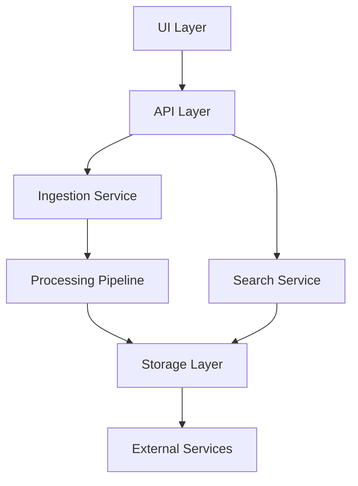
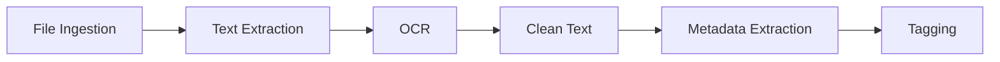
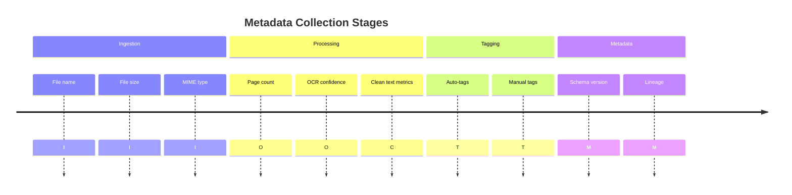

# File Management Service Architecture

## System Overview

## Component Architecture

### 1. Ingestion Layer
- **Web Upload** (existing)
  - Drag & drop interface
  - Multi-file selection
- **Storage Backends** (partial)
  - Local storage (stubbed)
  - Google Drive (TODO)
  - S3/Minio (TODO)
- **FastAPI Worker** (existing)

### 2. Processing Pipeline (partial)

### 3. Storage Layer
- **Metadata Storage** (basic)
- **File Storage** (basic)
- **Vector Storage** (TODO - Qdrant)
- **Full-text Search** (TODO - Millisearch)

### 4. Search & Retrieval
- **Hybrid Search** (TODO)
- **AI Re-ranking** (TODO)

### 5. API Layer (basic)
- REST endpoints (existing)
- GraphQL (TODO)
- Webhooks (TODO)

## Metadata Flow

## Integration Points
1. **Tika Integration** (Text extraction)
2. **OCR Services**:
   - Tesseract + Pillow
   - Mistral OCR API
3. **LLM Services**:
   - Llama-3.1-Storm-8B
   - OpenAI/Claude APIs
4. **Vector Database**: Qdrant
5. **Search Engine**: Millisearch

## Next Steps
1. Complete storage backend implementations
2. Integrate Tika for text extraction
3. Enhance OCR services
4. Implement full metadata capture
5. Add vector search capabilities
